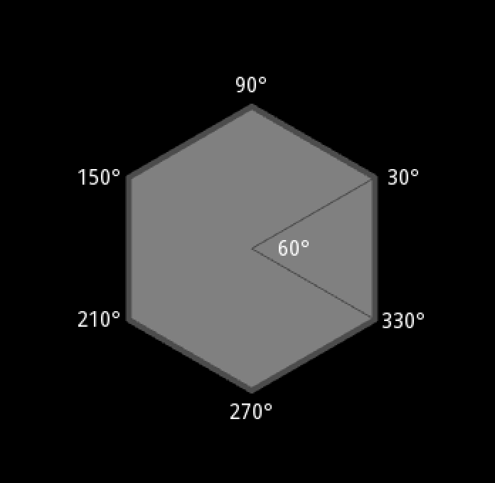

Hexagon Angles
==============

헥사곤 각도

<http://www.redblobgames.com/grids/hexagons/#basics>

<p></p>

* 표준 육각형 내각(interior angle): 120 도
* 6 개 정삼각형(equilateral triangle) 6조각(wedges)
* 정삼각형 내각: 60도
* i 번째 꼭지점 각도 위치: 시작각 + (60 * i) 도

   ```python
    class Hexagon(object):
        INSIDE_ANGLE_DEG = 60

        _base_angle_deg = 30

        @classmethod
        def set_base_angle_deg(cls, deg):
            cls._base_angle_deg = deg

        @classmethod
        def get_corner_angle_deg(cls, i):
            return cls._base_angle_deg + cls.INSIDE_ANGLE_DEG * i
   ```
