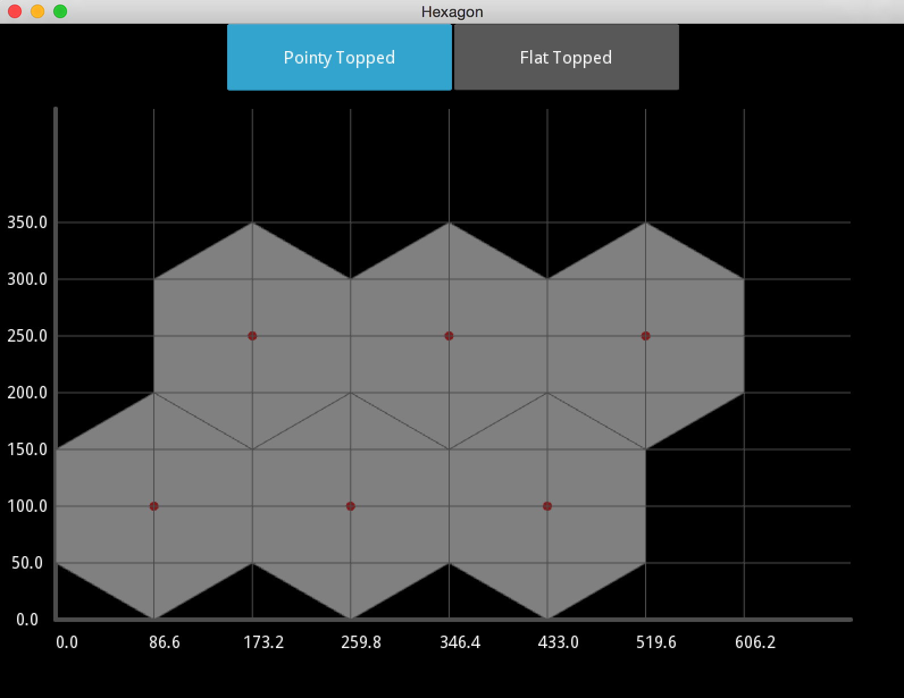
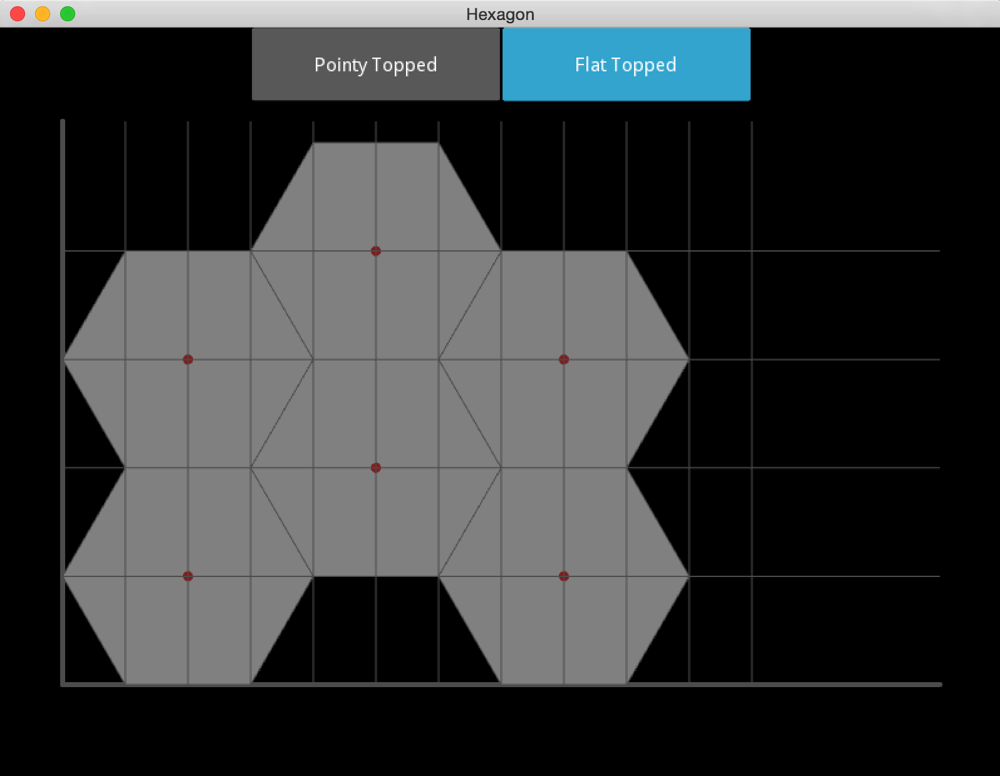

Hexagon Size and Spacing 
========================

헥사곤 크기와 간격

<http://www.redblobgames.com/grids/hexagons/#basics>

가로 정렬
---------

* 높이: 모서리 길이 * 2
* 너비: 높이 * sqrt(3) / 2 = 모서리 길이 * sqrt(3) * 2
* 세로 간격: 높이 * 3 / 4 = 모서리 길이 * 3 / 2
* 가로 간격: 너비 

세로 정렬
---------

* 너비: 모서리 길이 * 2
* 높이: 너비 * sqrt(3) / 2 = 모서리 길이 * sqrt(3) * 2
* 가로 간격: 너비 * 3 / 4 = 모서리 길이 * 3 / 2
* 세로 간격: 높이
