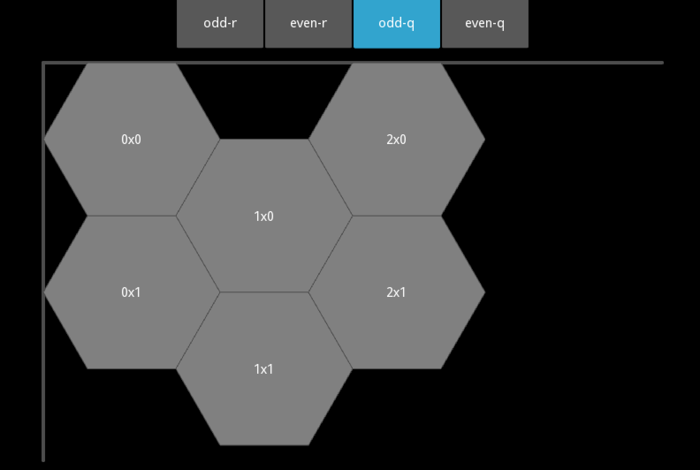
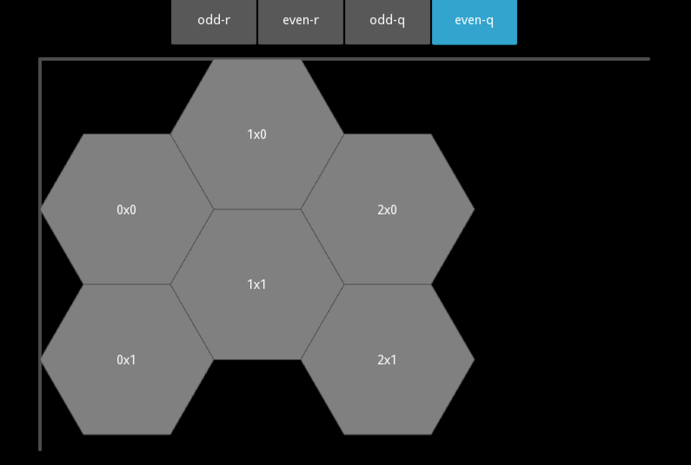

Offset Coordinates 
==================

<http://www.redblobgames.com/grids/hexagons/#coordinates>

* 오프셋 좌표 (q, r)
    * 열(col:q) 
    * 행(row:r)
* 종류: (행 or 열) % 2 == (홀수 or 짝수) 일때 반칸 이동
    * 홀수 행(odd-r)
    * 짝수 행(even-r)
    * 홀수 열(odd-q)
    * 짝수 열(even-q)

홀수 행
-------

짝수 행
-------

홀수 열
-------

짝수 열
-------

